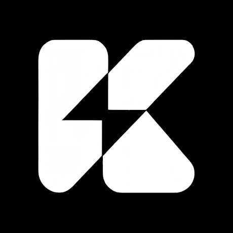

<h1 align="center">KrivsMP</h1>

A business platform for a company's internal ecosystem aimed at developing, automating and simplifying work processes in various departments.

The system provides monitoring, analytics and automation of work with data of different formats, and also acts as a knowledge base with the ability to analyze experience through artificial intelligence technologies. The development of personalized solutions in UX/UI-design with a focus on accessibility (A11Y) is envisaged.

The platform is designed to improve the efficiency of business processes, user experience and compliance with modern development standards.
